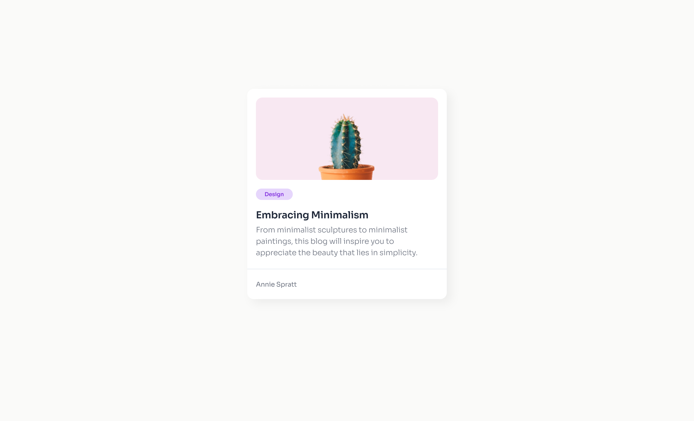

<h1><a href="https://devchallenges.io/challenge/27" target="_blank">Minimal Blog Card</a></h1>

This challenge is a great way to start with basic HTML and CSS skills. The challenge is to create a simple blog card that includes an image, a title, a short description, and a tag.

